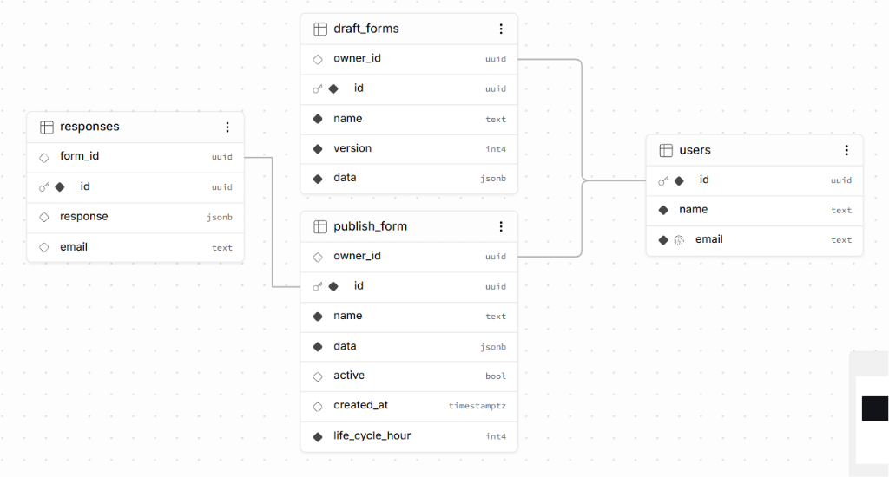

# SkyForms

SkyForms is an end-to-end form building platform for creating, managing, and sharing forms.

The project is being developed as a Single Page Application using Vanilla JavaScript to explore frontend architecture without frameworks, including custom state management, routing, and page lifecycle management.

## Tech Stack

**Frontend:** Vanilla JavaScript · HTML · CSS · Sortable.js · Zod  
**Backend:** FastAPI · Pydantic · asyncpg · websockets · Groq API · SQL
**Database:** PostgreSQL
**Auth:** Google OpenId Connect with JWT Based Session Authentication

## Database Schema

  

## Current Status

🚧 **Work in Progress**

Next Steps Are:

- endpoint to fetch entire landing page info
- endpoint to upadte version based unpublished draft
- Building the form preview experience.
- Implementing the draft-to-published form workflow.

The project is actively evolving, and the scope and feature set will continue to expand as development progresses.